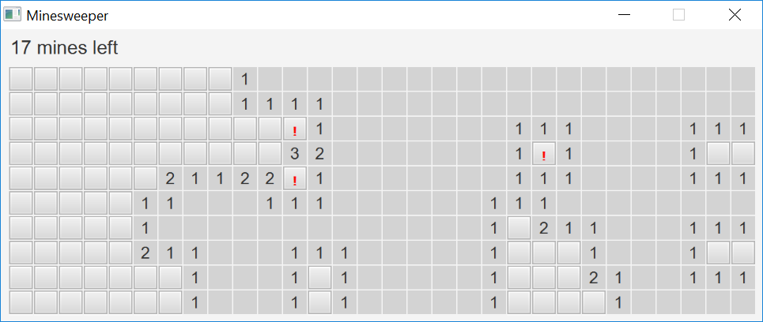

# Minesweeper

Sample application for my COMP 303 Software Design course at McGill. 

The goal of this project is to help illustrate
various design decisions related to abstraction, encapsulation, and information hiding, in the context of a complete working application. The rest of the code has been left to a minimum. Common best practices not implemented here would include externalizing strings and using icons in the UI, which were judged to be superfluous at this point.

This application was also designed to be simple enough to be realizable without the help of the Observer pattern. Although using the Observer as part of this design would make a ton of sense, the idea here was to have a code base that could be used for discussion *before* the Observer is seen as part of the course.

## Running from the Eclipse Workspace

These instructions assume you have Java and Eclipse installed.

1. Install JavaFX and create a library for it in Eclipse by following [these instructions](https://openjfx.io/openjfx-docs/#IDE-Eclipse)
2. Make sure you call your library `JavaFX14` even if you are using a different version.
3. When you run the application, from the run configuration, make sure the checkbox "Use the -XstartOnFirstThread argument when launching with SWT" is not checked. 
