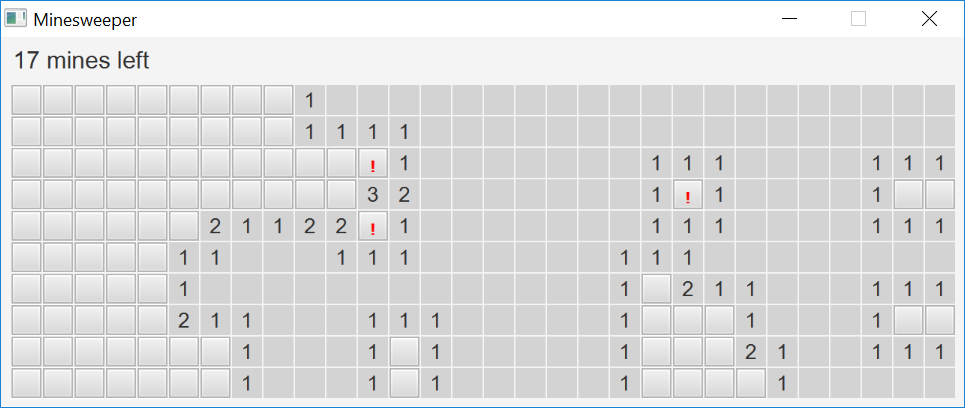

# Minesweeper

Sample Java application with JavaFX. Demonstration application used in the book [Introduction to Software Design with Java](https://link.springer.com/book/10.1007/978-3-030-24094-3).

The goal of this project is to help illustrate various design decisions related to abstraction, encapsulation, and information hiding, in the context of a complete working application. The rest of the code has been left to a minimum. Common best practices not implemented here would include externalizing strings and using icons in the UI.

This application was also designed to be simple enough to be realizable without the help of the Observer pattern. Although using the Observer as part of this design would make a sense, the idea here was to have a code base that could be used for discussion without knowing about the Observer pattern.



## Building and Running with Eclipse

This repository is configured to build automatically in Eclipse with Java 21 and JavaFX 21. However, when first imported, the project will show a compilation error because the JavaFX dependency is missing.

To add JavaFX:

1. Download [JavaFX 21](https://jdk.java.net/javafx21/);
2. Create a new `User Library` under `Eclipse -> Window -> Preferences -> Java -> Build Path -> User Libraries -> New`. Name it `JavaFX21` and include the jars under the `lib` folder from the location where you extracted the JavaFX download.

The project should then build properly. To run the application within the Eclipse workspace:

* Right-click on the project and select `Run As -> Java Application`. Select `Minesweeper` from the list. 
* To run the tests, select `Run As - > JUnit Test`.

_**MacOs Users**: When you run the application, from the run configuration, make sure the checkbox "Use the -XstartOnFirstThread argument when launching with SWT" is _not_ checked._ 

## Building and Running with Maven

The following commands can be run from the command line or by right-clicking on the `pom.xml` file and selecting `Run As...`.

* Compiling: `mvn clean compile`
* Validating style: `mvn compile checkstyle:check`
* Testing: `mvn clean test`
* Packaging: `mvn clean package` or `mvn clean package -Pfat` to create a fat jar. This command will also create the javadocs in `target/docs`
* Running: `mvn clean javafx:run@run`

By default,packaging creates a thin jar as `target/Minesweeper-VERSION.jar`. To run the packaged application from the thin jar, you must have the JavaFX library downloaded somewhere, assumed to be `PATH_TO_JAVAFX_LIB`. To run the jar, open a command-line terminal window and enter the command below from the same directory where you downloaded the file, or write a script to execute it more conveniently.

```
java --module-path PATH_TO_JAVAFX_LIB --add-modules=javafx.controls -jar Minesweeper-VERSION.jar
```

To run the packaged application from the far jar, simply run the jar as:

```
java -jar Minesweeper-VERSION.jar
```